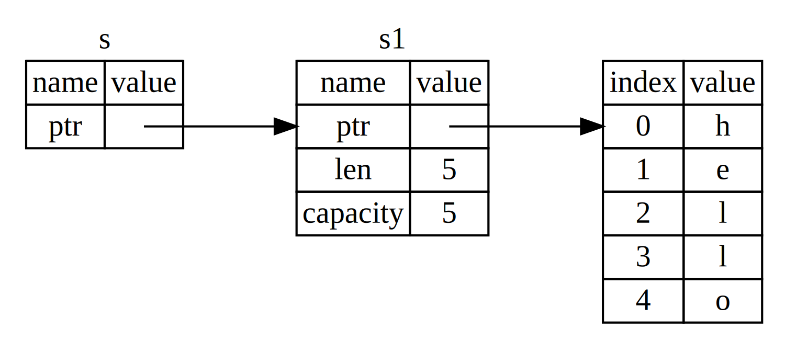

## Tagairtí agus Iasacht

Is í an tsaincheist leis an gcód tuple i Liosta 4-5 ná go gcaithfimid an
`String` don fheidhm ghlao ionas gur féidir linn fós an `String` a úsáid tar éis an
glaoigh go `calculate_length`, mar gur aistríodh an `String` isteach
`calculate_length`. Ina áit sin, is féidir linn tagairt a sholáthar don luach `String`.
Tá _reference_ cosúil le pointeoir sa mhéid is gur seoladh é ar féidir linn rochtain a fháil air
na sonraí atá stóráilte ag an seoladh sin; is le hathróg éigin eile na sonraí sin.
Murab ionann agus pointeoir, ráthaítear le tagairt luach bailí a
cineál ar leith do shaolré na tagartha sin.

Seo é an chaoi a shaineofá agus a n-úsáidfeá feidhm `calculate_length` a bhfuil a
tagairt do réad mar pharaiméadar in ionad úinéireacht a ghlacadh ar an luach:

<Listing file-name="src/main.rs">

```rust
{{#rustdoc_include ../../listings/ch04-understanding-ownership/no-listing-07-reference/src/main.rs:all}}
```

</Listing>

Gcéad dul síos, faoi deara go léir an cód tuple sa dearbhú athróg agus an
Tá luach ar ais feidhm imithe. Ar an dara dul síos, tabhair faoi deara go gcuirimid `&s1` isteach
`calculate_length` agus, ina shainmhíniú, glacaimid `&String` seachas
`String`. Is ionann na hampersands seo agus _references_, agus ligeann siad duit tagairt a dhéanamh
ar luach éigin gan úinéireacht a ghlacadh air. Léiríonn Fíor 4-6 an coincheap seo.



<span class="caption">Fíor 4-6: Léaráid de `&String s` ag pointeáil ar `String
s1`</span>

> Nóta: Is é _dereferencing_ a mhalairt de thagairtí trí úsáid a bhaint as `&`, is é sin
> bainte amach leis an oibreoir dereference, `*`. Feicfimid roinnt úsáidí as an
> oibreoir dereference i gCaibidil 8 agus pléigh sonraí na díthagartha i
> Caibidil 15 .

Breathnaímis ar an nglao feidhme anseo:

```rust
{{#rustdoc_include ../../listings/ch04-understanding-ownership/no-listing-07-reference/src/main.rs:here}}
```

Ligeann an chomhréir `&s1` dúinn tagairt a chruthú a _tagraíonn_ do luach `s1`
ach ní leis é. Toisc nach leis an tagairt í, díríonn an luach
ní scaoilfear leis nuair a stopann úsáid na tagartha.

Mar an gcéanna, úsáideann síniú na feidhme `&` chun a chur in iúl go bhfuil an cineál
is tagairt é an paraiméadar `s`. Cuirimis roinnt nótaí míniúcháin leis:

```rust
{{#rustdoc_include ../../listings/ch04-understanding-ownership/no-listing-08-reference-with-annotations/src/main.rs:here}}
```

Is ionann an scóip ina bhfuil an athróg `s` bailí agus feidhm ar bith
raon feidhme an pharaiméadar, ach ní thittear an luach a luann an tagairt
nuair a stopann `s` á úsáid, mar níl úinéireacht ag `s`. Nuair a feidhmeanna
tagairtí a bheith agat mar pharaiméadair in ionad na luachanna iarbhír, ní bheidh orainn
na luachanna a thabhairt ar ais chun úinéireacht a thabhairt ar ais, mar ní raibh againn riamh
úinéireacht.

Glaoimid ar an ngníomh chun tagairt a chruthú _iasacht_. Mar atá sa saol fíor, más rud é a
is leis an duine rud éigin, is féidir leat é a fháil ar iasacht uathu. Nuair a bheidh tú críochnaithe, tá
é a thabhairt ar ais. Ní leatsa é.

Mar sin, cad a tharlóidh má dhéanaimid iarracht rud éigin atá á fháil ar iasacht againn a mhodhnú? Bain triail as an gcód i
Liostáil 4-6. Foláireamh spoiler: ní oibríonn sé!

<Listing number="4-6" file-name="src/main.rs" caption="Attempting to modify a borrowed value">

```rust,ignore,does_not_compile
{{#rustdoc_include ../../listings/ch04-understanding-ownership/listing-04-06/src/main.rs}}
```

</Listing>

Seo an earráid:

```console
{{#include ../../listings/ch04-understanding-ownership/listing-04-06/output.txt}}
```

Díreach mar a bhíonn athróga do-athchurtha de réir réamhshocraithe, is amhlaidh atá tagairtí. Nílimid
cead rud éigin a bhfuil tagairt againn dó a mhodhnú.

### Tagairtí Mutable

Is féidir linn an cód ó Liosta 4-6 a shocrú chun ligean dúinn luach a fuarthas ar iasacht a mhionathrú
gan ach cúpla tweaks beaga a úsáideann, ina ionad sin, tagairt _mutable_:

<Listing file-name="src/main.rs">

```rust
{{#rustdoc_include ../../listings/ch04-understanding-ownership/no-listing-09-fixes-listing-04-06/src/main.rs}}
```

</Listing>

Ar dtús athraíonn muid `s` le bheith `mut`. Ansin cruthaímid tagairt mutable le `&mut
s` áit a dtugaimid an fheidhm `change`, agus nuashonraímid síniú na feidhme go
glac le tagairt mutable le `some_string: &mut String`. Déanann sé seo an-
soiléir go n-athróidh an fheidhm `change` an luach a gheobhaidh sé ar iasacht.

Tá srian mór amháin ag tagairtí mutable: má tá tagairt shoghluaiste agat do
luach, ní féidir aon tagairtí eile a bheith agat don luach sin. An cód seo go
theipeann ar iarrachtaí dhá thagairt sho-shóite a chruthú do `s`:

<Listing file-name="src/main.rs">

```rust,ignore,does_not_compile
{{#rustdoc_include ../../listings/ch04-understanding-ownership/no-listing-10-multiple-mut-not-allowed/src/main.rs:here}}
```

</Listing>

Seo an earráid:

```console
{{#include ../../listings/ch04-understanding-ownership/no-listing-10-multiple-mut-not-allowed/output.txt}}
```

Deir an earráid seo go bhfuil an cód seo neamhbhailí toisc nach féidir linn `s` a fháil ar iasacht mar
mutable níos mó ná uair amháin ag an am. Tá an chéad iasacht sho-shóite i `r1` agus ní mór
deireanach go dtí go n-úsáidtear é sa `println!`, ach idir chruthú sin
tagairt mutable agus a úsáid, rinneamar iarracht tagairt eile a chruthú mutable
in `r2` a fhaigheann na sonraí céanna ar iasacht le `r1`.

An srian a chuireann cosc ​​ar thagairtí mutable iolracha do na sonraí céanna ag an
ceadaíonn an t-am céanna sóchán ach ar bhealach an-rialaithe. Is rud é
a mbíonn na Rustaceans nua ag streachailt leo mar ligeann formhór na dteangacha duit sóchán a dhéanamh
aon uair is mian leat. Is é an buntáiste a bhaineann leis an srianadh seo ná gur féidir le Rust
cosc a chur ar rásaí sonraí ag am tiomsaithe. Tá rás _data_ cosúil le rás
riocht agus a tharlaíonn nuair a tharlaíonn na trí iompar seo:

- Tá rochtain ag dhá threo nó níos mó ar na sonraí céanna ag an am céanna.
- Tá ceann amháin ar a laghad de na leideanna á n-úsáid chun na sonraí a scríobh.
- Níl aon mheicníocht á húsáid chun rochtain ar na sonraí a shioncronú.

Is cúis le hiompar neamhshainithe is cúis le rásaí sonraí agus is féidir leo a bheith deacair a dhiagnóiseadh agus a shocrú
nuair atá tú ag iarraidh iad a rianú síos ag am rite; Coscann meirge an fhadhb seo trí
ag diúltú cód a thiomsú le rásaí sonraí!

Mar is gnáth, is féidir linn lúibíní cuartha a úsáid chun raon feidhme nua a chruthú, rud a cheadaíonn
tagairtí iolracha mutable, ní hamháin cinn _comhuaineacha_:

```rust
{{#rustdoc_include ../../listings/ch04-understanding-ownership/no-listing-11-muts-in-separate-scopes/src/main.rs:here}}
```

Forfheidhmíonn meirge riail chomhchosúil maidir le tagairtí in-shóite agus neamh-inmheasartha a chomhcheangal.
Tá earráid mar thoradh ar an gcód seo:

```rust,ignore,does_not_compile
{{#rustdoc_include ../../listings/ch04-understanding-ownership/no-listing-12-immutable-and-mutable-not-allowed/src/main.rs:here}}
```

Seo an earráid:

```console
{{#include ../../listings/ch04-understanding-ownership/no-listing-12-immutable-and-mutable-not-allowed/output.txt}}
```

Whew! Ní féidir tagairt chomhshóite a bheith againn _freisin_, cé go bhfuil ceann nach féidir a mhalartú againn
ar an luach céanna.

Ní bhíonn úsáideoirí teistiméireachta domhalartaithe ag súil go n-athróidh an luach go tobann
ó thíos leo! Mar sin féin, ceadaítear tagairtí iolracha domhalartaithe toisc nach bhfuil
tá an cumas ag an té atá díreach ag léamh na sonraí dul i bhfeidhm ar dhaoine eile
léamh na sonraí.

Tabhair faoi deara go dtosaíonn scóip teistiméireachta ón áit a dtugtar isteach é agus go leanann sé ar aghaidh
tríd an uair dheireanach a úsáidtear an tagairt sin. Mar shampla, déanfaidh an cód seo
tiomsaigh toisc go bhfuil an úsáid dheireanach a bhaintear as na tagairtí domhalartaithe sa `println!`,
sula dtabharfar isteach an tagairt mutable:

```rust,edition2021
{{#rustdoc_include ../../listings/ch04-understanding-ownership/no-listing-13-reference-scope-ends/src/main.rs:here}}
```

Críochnaíonn scóip na dtagairtí domhalartaithe `r1` agus `r2` tar éis an `println!`
an áit a n-úsáidtear go deireanach iad, is é sin roimh an tagairt mutable `r3`
cruthaithe. Ní fhorluíonn na scóip seo, mar sin ceadaítear an cód seo: is féidir leis an tiomsaitheoir
abair nach bhfuil an tagairt á húsáid a thuilleadh ag pointe roimh dheireadh na
an scóip.

Cé go bhféadfadh earráidí iasachtaithe a bheith frustrachas uaireanta, cuimhnigh go bhfuil
an tiomsaitheoir Rust ag cur in iúl fabht féideartha go luath (ag am tiomsaithe in áit
ná ag am rite) agus a thaispeánann go beacht duit cá bhfuil an fhadhb. Ansin ní dhéanann tú
caithfidh tú a lorg cén fáth nach bhfuil do shonraí mar a cheap tú a bhí ann.

### Tagairtí Crochta

I dteangacha le leideanna, is furasta _crochta a chruthú go hearráideach
pointeoir_—pointeoir a dhéanann tagairt d’ionad i gcuimhne a d’fhéadfadh a bheith
a thugtar do dhuine eile - trí chuimhne a shaoradh agus pointeoir chuige sin á chaomhnú
cuimhne. I Rust, i gcodarsnacht leis sin, ráthaíonn an tiomsaitheoir go mbeidh tagairtí
riamh a bheith crochta tagairtí: má tá tú tagairt do roinnt sonraí, an
áiritheoidh tiomsaitheoir nach rachaidh na sonraí as raon feidhme roimh an
déanann tagairt do na sonraí.

Déanaimis iarracht tagairt dhochrach a chruthú lena fheiceáil conas a chuireann Rust cosc ​​orthu le a
earráid ama tiomsaithe:

<Listing file-name="src/main.rs">

```rust,ignore,does_not_compile
{{#rustdoc_include ../../listings/ch04-understanding-ownership/no-listing-14-dangling-reference/src/main.rs}}
```

</Listing>

Seo an earráid:

```console
{{#include ../../listings/ch04-understanding-ownership/no-listing-14-dangling-reference/output.txt}}
```

Tagraíonn an teachtaireacht earráide seo do ghné nár chlúdaigh muid go fóill: saolréanna. Déanfaimid
pléigh saolréanna go mion i gCaibidil 10. Ach, má dhéanann tú neamhaird ar na codanna
maidir le saolréanna, tá an eochair sa teachtaireacht maidir le cén fáth gur fadhb é an cód seo:

```téacs
tá luach a fuarthas ar iasacht i gcineál aischuir na feidhme seo, ach níl aon luach ann
chun é a fháil ar iasacht uaidh
```

Breathnaímis ar cad go díreach atá ag tarlú ag gach céim dár gcuid
cód `dangle`:

<Listing file-name="src/main.rs">

```rust,ignore,does_not_compile
{{#rustdoc_include ../../listings/ch04-understanding-ownership/no-listing-15-dangling-reference-annotated/src/main.rs:here}}
```

</Listing>

Toisc go gcruthaítear `s` taobh istigh de `dangle`, nuair a bhíonn an cód `dangle` críochnaithe,
beidh `s` dealaithe. Ach rinneamar iarracht tagairt a thabhairt ar ais dó. Ciallaíonn sé sin
bheadh ​​an tagairt seo ag tagairt do `String` neamhbhailí. Níl sin go maith! Meirge
ná lig dúinn é seo a dhéanamh.

Is é an réiteach anseo ná an `String` a thabhairt ar ais go díreach:

```rust
{{#rustdoc_include ../../listings/ch04-understanding-ownership/no-listing-16-no-dangle/src/main.rs:here}}
```

Oibríonn sé seo gan aon fhadhbanna. Tá úinéireacht ar athraíodh a ionad amach, agus tá rud ar bith
dealraithe.

### Na Rialacha Tagartha

Gabhaimis siar a bhfuil pléite againn faoi thagairtí:

- Ag aon am ar leith, is féidir leat _ceachtar_ tagairt sho-shóite amháin a bheith agat _nó_ ar bith
 líon na dtagairtí dochorraithe.
- Caithfidh teistiméireachtaí a bheith bailí i gcónaí.

Ansin, féachfaimid ar thagairt de chineál eile: slices.