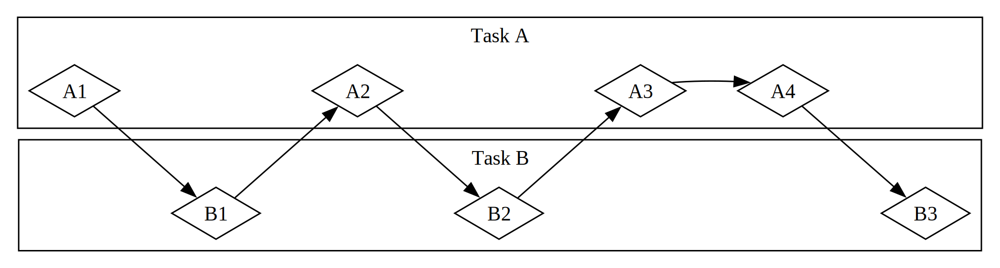

# Bunúsacha na Cláreagraithe Asincrónaí: Asincrónach, Fanacht, Todhchaí, agus Sruthanna

Féadann sé tamall a thógáil chun go leor oibríochtaí a iarrann muid ar an ríomhaire a dhéanamh a chríochnú. Bheadh ​​sé
deas dá bhféadfaimis rud éigin eile a dhéanamh agus muid ag fanacht leis na
próisis fhada sin a bheith críochnaithe. Cuireann ríomhairí nua-aimseartha dhá theicníc ar fáil chun
oibriú ar níos mó ná oibríocht amháin ag an am: comhthreomhaireacht agus comhthráthacht. Nuair a
thosaímid ag scríobh clár a bhaineann le hoibríochtaí comhthreomhara nó comhthráthacha,
áfach, tagaimid go tapa ar dhúshláin nua a bhaineann le _chláreagrú_asincrónach_, áit nach bhféadfadh oibríochtaí críochnú go seicheamhach san ord a
tosaíodh. Tógálann an chaibidil seo ar úsáid snáitheanna i gCaibidil 16 le haghaidh comhthreomhaireachta
agus comhthráthachta trí chur chuige malartach a thabhairt isteach i leith
chláreagrú_asincrónach: Todhchaí, Sruthanna Rust, an comhréir `async` agus `await` a
thacaíonn leo, agus na huirlisí chun oibríochtaí
asincrónacha a bhainistiú agus a chomhordú.

Breithnímis ar shampla. Abair go bhfuil tú ag easpórtáil físeán atá cruthaithe agat de
cheiliúradh teaghlaigh, oibríocht a d'fhéadfadh nóiméad go huaireanta a thógáil.
Úsáidfidh an easpórtáil físeáin an oiread cumhachta LAP agus GPU agus is féidir leis. Dá mbeadh
croílár LAP amháin agat agus mura gcuirfeadh do chóras oibriúcháin an easpórtáil sin ar sos go dtí go
bhí sé críochnaithe—is é sin, dá ndéanfadh sé an easpórtáil _go sioncrónach_—ní fhéadfá
aon rud eile a dhéanamh ar do ríomhaire agus an tasc sin á rith. Bheadh ​​sé sin
ina thaithí sách frustrach. Ar ámharaí an tsaoil, is féidir le córas oibriúcháin do ríomhaire,
agus déanann sé, cur isteach go dofheicthe ar an easpórtáil go minic go leor chun ligean duit
obair eile a dhéanamh ag an am céanna.

Anois abair go bhfuil tú ag íoslódáil físeán a roinneann duine eile, rud a d'fhéadfadh tamall a thógáil freisin
ach nach nglacann an oiread sin ama LAP. Sa chás seo, caithfidh an LAP fanacht
le go dtiocfaidh sonraí ón líonra. Cé gur féidir leat tosú ag léamh na sonraí a luaithe
a thosaíonn siad ag teacht, d'fhéadfadh sé tamall a thógáil chun iad go léir a thaispeáint. Fiú nuair a bheidh na sonraí go léir i láthair, má tá an físeán sách mór, d'fhéadfadh sé soicind nó dhó a thógáil chun é a luchtú go léir. B'fhéidir nach bhfuil cuma mhór air sin, ach is tréimhse an-fhada é do phróiseálaí nua-aimseartha, ar féidir leis na billiúin oibríochtaí a dhéanamh gach soicind. Arís, cuirfidh do chóras oibriúcháin isteach go dofheicthe ar do chlár chun ligean don LAP obair eile a dhéanamh agus é ag fanacht leis an nglao líonra a bheith críochnaithe.

Is sampla d'oibríocht _ceangailte le LAP_ nó _ceangailte le ríomh_ é an onnmhairiú físeáin.
Tá sé teoranta ag luas próiseála sonraí féideartha an ríomhaire laistigh den LAP nó
GPU, agus cé mhéad den luas sin is féidir leis a thiomnú don oibríocht. Is sampla d'oibríocht _ceangailte le hIO_ é an íoslódáil físeáin, toisc go bhfuil sé teoranta ag
luas _ionchuir agus aschuir_ an ríomhaire; ní féidir leis dul ach chomh tapa agus is féidir na sonraí
a sheoladh trasna an líonra.

Sna samplaí seo araon, soláthraíonn cur isteach dofheicthe an chórais oibriúcháin
cineál comhthráthachta. Ní tharlaíonn an comhthráthacht sin ach ag leibhéal an chláir iomláin, áfach: cuireann an córas oibriúcháin isteach ar chlár amháin chun ligean do chláir eile
obair a dhéanamh. I go leor cásanna, toisc go dtuigeann muid ár gcláir ar
leibhéal i bhfad níos mine ná mar a dhéanann an córas oibriúcháin, is féidir linn
deiseanna le haghaidh comhthráthachta nach féidir leis an gcóras oibriúcháin a fheiceáil a fheiceáil.

Mar shampla, má táimid ag tógáil uirlis chun íoslódálacha comhad a bhainistiú, ba cheart go mbeimid
in ann ár gclár a scríobh sa chaoi is nach gcuirfidh tús le híoslódáil amháin bac ar an gcomhéadan úsáideora,
agus ba cheart go mbeadh úsáideoirí in ann il-íoslódálacha a thosú ag an am céanna. Tá go leor
APIanna córais oibriúcháin chun idirghníomhú leis an líonra ag _blocáil_, áfach;
is ​​é sin, cuireann siad bac ar dhul chun cinn an chláir go dtí go mbeidh na sonraí atá á bpróiseáil acu
réidh go hiomlán.

> Nóta: Seo mar a oibríonn _an chuid is mó_ de ghlaonna feidhme, má smaoiníonn tú air. Mar sin féin,
> is gnách go mbíonn an téarma _blocáil_ curtha in áirithe do ghlaonna feidhme a idirghníomhaíonn le
> comhaid, an líonra, nó acmhainní eile ar an ríomhaire, mar is iad sin na
> cásanna ina mbainfeadh clár aonair leas as an oibríocht a bheith
> _neamh_-bhlocálach.

D'fhéadfaimis ár bpríomhshnáithe a sheachaint trí shnáithe tiomnaithe a chruthú chun
gach comhad a íoslódáil. Mar sin féin, bheadh ​​​​forchostais na snáitheanna sin ina fhadhb sa deireadh. Bheadh ​​​​sé níos fearr mura mbeadh an glao blocáilte sa chéad
áit. Bheadh ​​​​sé níos fearr freisin dá bhféadfaimis scríobh san stíl dhíreach chéanna a úsáidimid
i gcód blocála, cosúil leis seo:

```rust,ignore,does_not_compile
let data = fetch_data_from(url).await;
println!("{data}");
```

Sin go díreach a thugann teibíocht _async_ (gearr do _asynchronous_) Rust
dúinn. Sa chaibidil seo, foghlaimeoidh tú gach rud faoi neamhshioncrónach agus muid ag clúdach na dtopaicí seo a leanas:

- Conas comhréir `async` agus `await` Rust a úsáid
- Conas an tsamhail neamhshioncrónach a úsáid chun cuid de na dúshláin chéanna a ndearnamar breathnú orthu i gCaibidil 16 a réiteach
- Conas a sholáthraíonn il-shnáithe agus neamhshioncrónach réitigh chomhlántacha, ar féidir leat a chomhcheangal i go leor cásanna

Sula bhfeicfimid conas a oibríonn neamhshioncrónach i gcleachtas, áfach, ní mór dúinn seachbhóthar gearr a ghlacadh chun na difríochtaí idir comhthreomhaireacht agus comhthráthacht a phlé.

### Comhthreomhaireacht agus Comhthráthacht

Tá comhthreomhaireacht agus comhthráthacht den chuid is mó inmhalartaithe againn go dtí seo. Anois
ní mór dúinn idirdhealú níos cruinne a dhéanamh eatarthu, mar go
n-éireoidh na difríochtaí
níos soiléire agus muid ag tosú ag obair.

Smaoinigh ar na bealaí éagsúla a d'fhéadfadh foireann obair a roinnt ar thionscadal bogearraí.
D'fhéadfá tascanna iolracha a shannadh do bhall aonair, tasc amháin a shannadh do gach ball, nó
meascán den dá chur chuige a úsáid.

Nuair a oibríonn duine aonair ar roinnt tascanna éagsúla sula mbíonn aon cheann acu
críochnaithe, is _comhthráthacht_ é seo. B’fhéidir go bhfuil dhá thionscadal éagsúla seiceáilte agat ar do ríomhaire, agus nuair a bhíonn tú leamh nó sáinnithe ar thionscadal amháin, aistríonn tú go dtí an ceann eile. Níl ionat ach duine amháin, mar sin ní féidir leat dul chun cinn a dhéanamh ar an dá thasc ag an am céanna, ach is féidir leat iltascanna a dhéanamh, ag déanamh dul chun cinn ar cheann ag an am trí athrú eatarthu (féach Fíor 17-1).

<figure>



<figcaption>Figure 17-1: A concurrent workflow, switching between Task A and Task B</figcaption>

</figure>

Nuair a roinneann an fhoireann grúpa tascanna trí gach ball a chur ag obair air ina aonar, is _comhthreomhaireacht_ é seo. Is féidir le gach duine ar an bhfoireann
dul chun cinn a dhéanamh ag an am céanna (féach Fíor 17-2).

<figure>


<figcaption>Fíor 17-2: Sreabhadh oibre comhthreomhar, áit a ndéantar obair ar Thasc A agus Tasc B go neamhspleách</figcaption>

</figure>

Sna sreabhanna oibre seo araon, b'fhéidir go mbeadh ort comhordú a dhéanamh idir
tascanna éagsúla. B’fhéidir gur cheap tú go raibh an tasc a shanntar do dhuine amháin go hiomlán neamhspleách ar obair gach duine eile, ach i ndáiríre éilíonn sé ar dhuine eile ar an bhfoireann a dtasc a chríochnú ar dtús. D’fhéadfaí cuid den obair a dhéanamh go comhthreomhar, ach bhí cuid di _sraitheach_ i ndáiríre: ní fhéadfadh sé tarlú ach i
sraith, tasc amháin i ndiaidh a chéile, mar atá i bhFíor 17-3.

<figure>


<figcaption>Fíor 17-3: Sreabhadh oibre atá comhthreomhar go páirteach, áit a ndéantar obair ar Thasc A agus ar Thasc B go neamhspleách go dtí go mbíonn bac ar Thasc A3 ar thorthaí Thasc B3.</figcaption>

</figure>

Mar an gcéanna, b'fhéidir go dtuigfeá go mbraitheann ceann de do thascanna féin ar cheann eile de do chuid tascanna. Anois tá do chuid oibre comhthráthach sraitheach freisin.

Is féidir le comhthreomhaireacht agus comhthráthacht trasnú lena chéile freisin. Má fhoghlaimíonn tú
go bhfuil comhghleacaí sáinnithe go dtí go gcríochnaíonn tú ceann de do thascanna, is dócha go ndíreoidh tú do chuid iarrachtaí go léir ar an tasc sin chun do chomhghleacaí a "dhíbhlocáil". Ní féidir leatsa agus do
chomhghleacaí oibriú go comhthreomhar a thuilleadh, agus ní féidir leatsa
oibriú go comhthreomhar ar do thascanna féin a thuilleadh.

Tagann na dinimic bhunúsacha chéanna i bhfeidhm le bogearraí agus crua-earraí. Ar mheaisín
le croí LAP amháin, ní féidir leis an LAP ach oibríocht amháin a dhéanamh ag an am, ach
is féidir leis oibriú go comhthreomhar fós. Ag baint úsáide as uirlisí ar nós snáitheanna, próisis, agus neamhshioncrónach,
is féidir leis an ríomhaire gníomhaíocht amháin a chur ar sos agus aistriú go cinn eile sula
bhfilleann sé ar an gcéad ghníomhaíocht sin arís. Ar mheaisín le croíleacáin iolracha LAP,
is féidir leis obair a dhéanamh go comhthreomhar freisin. Is féidir le croí amháin tasc amháin a dhéanamh agus
croí eile ceann nach mbaineann leis ar chor ar bith a dhéanamh, agus tarlaíonn na hoibríochtaí sin ag an am céanna i ndáiríre.

Nuair a bhíonn muid ag obair le neamhshioncrónach i Rust, bímid i gcónaí ag déileáil le comhthráthacht.
Ag brath ar an gcrua-earraí, an córas oibriúcháin, agus an t-am rith neamhshioncrónach atá á úsáid againn (tuilleadh faoi amanna rith neamhshioncrónacha go luath), féadfaidh an comhthráthacht sin comhthreomhaireacht a úsáid freisin
faoi chochall.

Anois, déanaimis iniúchadh ar an gcaoi a n-oibríonn cláir neamhshioncrónach i Rust i ndáiríre.